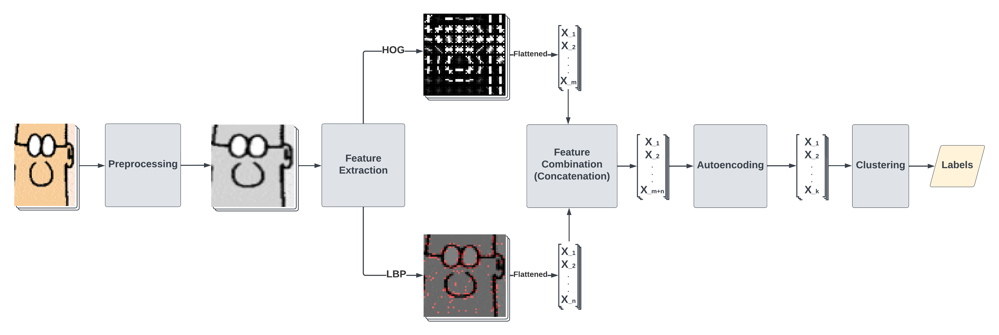
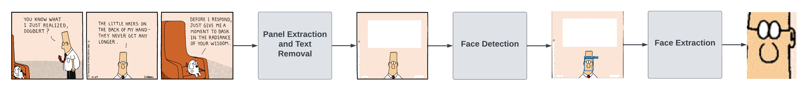

# Clustering Faces of Comic Characters

This repository contains the code used for [link coming once the paper is uploaded to tu delft repo].

Below is the structure of the repository.

## src

Contains the classes used in the face clustering pipeline, which is visualized below.

The pipeline is made up of 4 steps:

1. feature extraction
2. (optional) feature combination
3. (optional) dimensionality reduction
4. clustering.

The steps of the pipeline agree on a common folder structure. Below is an example
folder structure.

<pre>
example_feature_folder
├── clustering
         └── kmeans
             ├── clustering_config.json
             ├── cluster_labels.npy
             └── metrics.json
├── feature_config.json
├── features.npy
├── image_names.pickle
└── reductions
    ├── deep_ae
             ├── results
                     ├── configs.csv
                     └── kmeans_results.csv
             ├── run_0
                     ├── clustering
                             └── kmeans
                                 ├── clustering_config.json
                                 ├── cluster_labels.npy
                                 └── metrics.json
                     ├── features.npy
                     └── reducer_config.json
             └── run_1
                 ├── clustering
                         └── kmeans
                             ├── clustering_config.json
                             ├── cluster_labels.npy
                             └── metrics.json
                 ├── features.npy
                 └── reducer_config.json
    └── pca
        ├── results
                 ├── configs.csv
                 └── kmeans_results.csv
        ├── run_0
                 ├── clustering
                         └── kmeans
                             ├── clustering_config.json
                             ├── cluster_labels.npy
                             └── metrics.json
                 ├── features.npy
                 └── reducer_config.json
        └── run_1
            ├── clustering
                     └── kmeans
                         ├── clustering_config.json
                         ├── cluster_labels.npy
                         └── metrics.json
            ├── features.npy
            └── reducer_config.json
</pre>

Each feature contains its own reduced versions and clustering labels. Reductions and
clustering labels can be generated with different methods. Each method has its own
folder, such as `reductions/pca` and `reductions/deep_ae` for Principal Component
Analysis and deep neural network autoencoder, respectively. Each method can be run with
different configurations. Each configuration is contained in its own folder, such as
`reductions/pca/run_0` and `reductions/pca/run_1`. The evaluation is done and the
results are aggregated using `experiment_scripts/eval_and_agg.py`. The configurations
are aggregated using `experiment_scripts/get_run_configs.py`.

Steps 1, 3, and 4 have their own package and abstract classes that are responsible with
common tasks. These abstract classes can be extended to accommodate more algorithms. For
step 2, `features/combine_features.py` is used. This module operates on multiple feature
folders. It is responsible with collecting the configurations of each feature under a
single config file, identifying the images for which each feature method has a feature
vector, concatenating these feature vectors per image, and storing them in the same
folder structure. Thus, the combined feature can be treated as any other feature in the
later steps of the pipeline.

### Notes on Features

Each feature class is responsible with its own preprocessing, which must take place in
the `read_image` method of `AbstractFeature`.

Global features refer to feature extraction methods that produce fixed-size vectors for
each image (assuming that images have the same dimensions). Examples include HOG, and
LBP features. Local features refer to methods that produce a variable number of vectors
per image. These vectors are transformed into a single fixed-size vector using a vector
quantization method such as fisher vectors. Examples include ORB and SIFT features.

## face_extraction

Contains the code for the face extraction pipeline, which is visualized below.

The pipeline is made up of two steps

1. panel extraction and text cropping
2. face detection and extraction

You can use `panel_extraction_and_text_cropping/run.py` to run the panel extraction and
text cropping steps of the pipeline.

The second step relies on https://github.com/barisbatuhan/DASS_Det_Inference/tree/main,
so it must be installed as a separate repository. You can add the modules found in
`face_detection_and_extraction` inside that repository, and use
`face_detection_and_extraction/run.py` to run the face detection and extraction steps of
the pipeline.

## experiment_scripts

Contains scripts for running the steps of the face clustering pipeline. It also contains
other scripts that I used to produce the results of the paper.

## mmselfsup_simclr

For the training of SimCLR, I used mmselfsup library. The exact configuration I used is
contained in `training_config.py`. You can use `get_latent_vectors.py` to embed images
using the trained backbone. Refer to https://mmselfsup.readthedocs.io/en/latest/ for
more details on mmselfsup.